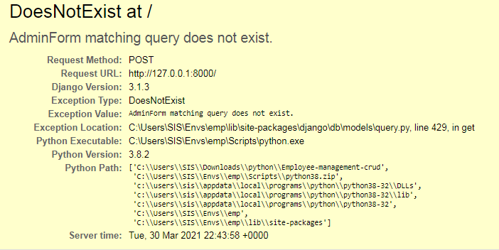
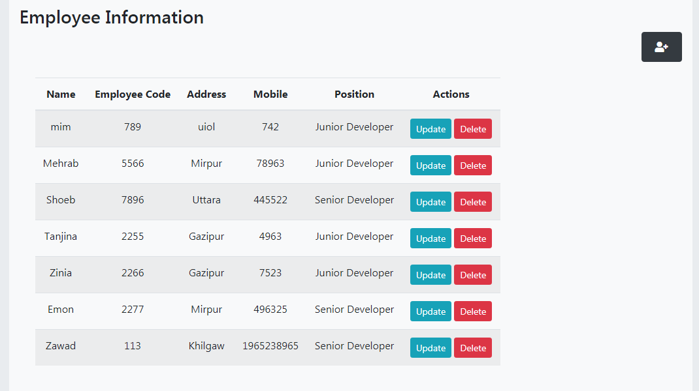

## Employee-Information-Management(CRUD)platform-Django,database postgresql
>Very basic project for practising django where admin can login and manages all the information of employees which  contains all crud operations.

 *For login use -  email :  admin@gmail.com  and  password  :  1234*
 
>login is not properly validate enough right now later I'm gonna fixed that.if you enter another email or pass you can see the error something like this




>I did another mistake that  instead of writing 'forms.ModelForm'  I wrote 'forms.Form' that's why it was giving me a error.


 ```
{
  class Admin_Login_Form(forms.Form):  #wrong
    class Meta:
        model=AdminForm
        fields='__all__'
}
```  
 ```
{
  class Admin_Login_Form(forms.ModelForm):  #right
    class Meta:
        model=AdminForm
        fields='__all__'
}
```  


>Here our app is employee_info.For making form, I used django 'model form', I created models first such as AdminForm,Designations,Employee.Then converted this models as form with the help of django 'modelforms' 

[For know more about 'Django Model Form' see the documentation](https://docs.djangoproject.com/en/3.0/topics/forms/modelforms/#modelform)

>I used 'django-crispy-forms' that provides you with a |crispy filter and  tag that will let you control the rendering behavior of your Django forms in a very elegant and DRY way. Have full control without writing custom form templates. All this without breaking the standard way of doing things in Django, so it plays nice with any other form application.

for using 'django-crispy-forms' you need to install it
 : pip install django-crispy-forms
[For know more about 'django-crispy-forms' see the documentation ](https://django-crispy-forms.readthedocs.io/en/latest/) 

>For run the project make sure you create an environment,Steps are  
<ul><li>If never install virtualenv then write pip install virtualenvwrapper -win</li>
<li>virtualenv (name)</li>
<li>cd Scripts</li>
<li>activated</li>
<li>cd..</li>
<li>cd..</li>
<li> for installing all the module of 'requirements.txt' file write this command 'pip install -r requirements.txt'</li> 
<li>Now you can run the project by this command  'python manage.py runserver'</li>
</ul>


